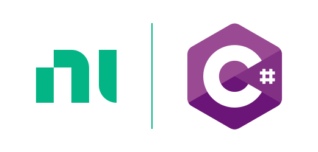

# NI C# Style Guide



---

Welcome to NI's internal and external C# conventions and linter rules/plugins/tooling.

`ni/csharp-styleguide` serves several purposes:

1. It contains our coding conventions/style guides for all C# code written for NI.
2. It contains custom Roslyn analyzers to enforce rules in our conventions that could not be found elsewhere.
3. It contains a package that can be consumed by a C# project to automatically configure coding conventions and analyzers.

## Quickstart

### Package Reference
Add a package reference to the package `NI.CSharp.Analyzers`. To find the latest versions, [look here](https://www.nuget.org/packages/NI.CSharp.Analyzers/).

```msbuild
<PackageReference Include="NI.CSharp.Analyzers" Version="<package-version>" />
```

**Note**: Currently, this package only works for projects that reference it using
[`PackageReference`](https://docs.microsoft.com/en-us/nuget/consume-packages/package-references-in-project-files).
Using [`packages.config`](https://docs.microsoft.com/en-us/nuget/reference/packages-config) to reference the package
is not going to work.

### Rulesets
Inside of the content directory of this NuGet package are the NI rulesets. `NI.ruleset` will be applied by default. 
If your project starts with `Tests.` or `!Tests`, or ends with `.Tests`, the `NI.Tests.ruleset` will be used. 
If your project starts with `TestUtilities.` or `!TestUtilities.`, the `NI.TestUtilities.ruleset` will be used.

## Coding Conventions

- [NI C# Style Guide](#ni-c-style-guide)
  - [Quickstart](#quickstart)
    - [Package Reference](#package-reference)
    - [Rulesets](#rulesets)
  - [Coding Conventions](#coding-conventions)
- [Purpose of coding conventions](#purpose-of-coding-conventions)
- [How to Read This Document](#how-to-read-this-document)
- [Formatting](#formatting)
  - [[F.1] Character Spacing](#f1-character-spacing)
    - [[F.1.1] ✔️ **DO** Use a single space after commas separating parameters 💻](#f11-️-do-use-a-single-space-after-commas-separating-parameters-)
    - [[F.1.2] ❌ **DO NOT** Use spaces between parentheses and parameters 💻](#f12--do-not-use-spaces-between-parentheses-and-parameters-)
    - [[F.1.3] ❌ **DO NOT** Use spaces between index operator brackets and the index expression 💻](#f13--do-not-use-spaces-between-index-operator-brackets-and-the-index-expression-)
    - [[F.1.4] ❌ **DO NOT** Use spaces between method names and parentheses 💻](#f14--do-not-use-spaces-between-method-names-and-parentheses-)
    - [[F.1.5] ✔️ **DO** Use a single space after control flow keywords 💻](#f15-️-do-use-a-single-space-after-control-flow-keywords-)
    - [[F.1.6] ✔️ **DO** Use a single space before and after comparison operators 💻](#f16-️-do-use-a-single-space-before-and-after-comparison-operators-)
  - [[F.2] Line Spacing](#f2-line-spacing)
    - [[F.2.1] ✔️ **DO** Separate type members with a single blank line, except private fields](#f21-️-do-separate-type-members-with-a-single-blank-line-except-private-fields)
    - [[F.2.2] ✔️ **CONSIDER** Use single blank lines to split method bodies into logically-related lines](#f22-️-consider-use-single-blank-lines-to-split-method-bodies-into-logically-related-lines)
    - [[F.2.3] ❌ **DO NOT** Place a blank line immediately inside curly braces 💻](#f23--do-not-place-a-blank-line-immediately-inside-curly-braces-)
    - [[F.2.4] ❌ **DO NOT** Place multiple blank lines together 💻](#f24--do-not-place-multiple-blank-lines-together-)
    - [[F.2.5] ✔️ **DO** Separate unrelated control flow blocks with a blank line](#f25-️-do-separate-unrelated-control-flow-blocks-with-a-blank-line)
  - [[F.3] Statement Complexity](#f3-statement-complexity)
    - [[F.3.1] ❌ **AVOID** Adding excessive complexity in compound statements](#f31--avoid-adding-excessive-complexity-in-compound-statements)
    - [[F.3.2] ✔️ **CONSIDER** Extracting methods from complex nested expressions](#f32-️-consider-extracting-methods-from-complex-nested-expressions)
    - [[F.3.3] ✔️ **CONSIDER** Splitting long parameter lists](#f33-️-consider-splitting-long-parameter-lists)
    - [[F.3.4] ✔️ **DO** Split chains of method invocations with lambda expressions 💻](#f34-️-do-split-chains-of-method-invocations-with-lambda-expressions-)
    - [[F.3.5] ✔️ **DO** Apply consistent formatting on split statements](#f35-️-do-apply-consistent-formatting-on-split-statements)
  - [[F.4] Indents and Braces](#f4-indents-and-braces)
    - [[F.4.1] ✔️ **DO** Use 4 space characters for indentation, never tab characters](#f41-️-do-use-4-space-characters-for-indentation-never-tab-characters)
    - [[F.4.2] ❌ **DO NOT** Use single-line statements with control flow keywords 💻](#f42--do-not-use-single-line-statements-with-control-flow-keywords-)
    - [[F.4.3] ✔️ **DO** Use braces around statement blocks governed by a control flow keyword (`if`, `else`, `while`), even if statement block is one line 💻](#f43-️-do-use-braces-around-statement-blocks-governed-by-a-control-flow-keyword-if-else-while-even-if-statement-block-is-one-line-)
    - [[F.4.4] ✔️ **DO** Place open curly braces on the next line after the opening statement of an embedded scope block 💻](#f44-️-do-place-open-curly-braces-on-the-next-line-after-the-opening-statement-of-an-embedded-scope-block-)
    - [[F.4.5] ❌ **Avoid** Placing multiple statements in a `switch` `case` block](#f45--avoid-placing-multiple-statements-in-a-switch-case-block)
    - [[F.4.6] ❌ **DO NOT** Use single-line scopes EXCEPT for single-item initializers or auto-implemented properties](#f46--do-not-use-single-line-scopes-except-for-single-item-initializers-or-auto-implemented-properties)
    - [[F.4.7] ✔️ **DO** Format multiple array or object property initializer statements into a multi-line embedded scope block](#f47-️-do-format-multiple-array-or-object-property-initializer-statements-into-a-multi-line-embedded-scope-block)
    - [[F.4.8] ✔️ **CONSIDER** Using C# lambda syntax for simple property and method implementations](#f48-️-consider-using-c-lambda-syntax-for-simple-property-and-method-implementations)
    - [[F.4.9] ✔️ **DO** Use braces with lambda expressions that span multiple lines](#f49-️-do-use-braces-with-lambda-expressions-that-span-multiple-lines)
- [Naming](#naming)
  - [[N.1] Casing Style](#n1-casing-style)
    - [[N.1.1] ✔️ **DO** Apply consistent casing style for identifiers 💻](#n11-️-do-apply-consistent-casing-style-for-identifiers-)
    - [[N.1.2] ✔️ **DO** Use underscore + camelCase for private fields and member variables](#n12-️-do-use-underscore--camelcase-for-private-fields-and-member-variables)
    - [[N.1.3] ✔️ **DO** Capitalize both letters of two-letter acronyms](#n13-️-do-capitalize-both-letters-of-two-letter-acronyms)
    - [[N.1.4] ✔️ **DO** Apply PascalCase style when using 3+letter acronyms](#n14-️-do-apply-pascalcase-style-when-using-3letter-acronyms)
    - [[N.1.5] ❌ **DO NOT** Use ALL CAPS for any name](#n15--do-not-use-all-caps-for-any-name)
  - [[N.2] Acronyms and Abbreviations](#n2-acronyms-and-abbreviations)
    - [[N.2.1] ❌ **DO NOT** Use acronyms unless they are generally accepted within NI or our client domains](#n21--do-not-use-acronyms-unless-they-are-generally-accepted-within-ni-or-our-client-domains)
    - [[N.2.2] ❌ **DO NOT** Use abbreviations unless they are commonly accepted terms](#n22--do-not-use-abbreviations-unless-they-are-commonly-accepted-terms)
  - [[N.3] ❌ **DO NOT** Use product names in APIs unless those APIs are truly exclusive to that product](#n3--do-not-use-product-names-in-apis-unless-those-apis-are-truly-exclusive-to-that-product)
  - [[N.4] ✔️ **CONSIDER** Using parameter/property names that imply usage, not structure. In general, do not embed type information into names](#n4-️-consider-using-parameterproperty-names-that-imply-usage-not-structure-in-general-do-not-embed-type-information-into-names)
  - [[N.5] Identifier Prefixing](#n5-identifier-prefixing)
    - [[N.5.1] ✔️ **DO** Prefix interfaces with `I` 💻](#n51-️-do-prefix-interfaces-with-i-)
    - [[N.5.2] ❌ **DO NOT** Prefix enums, classes or delegates with any letter](#n52--do-not-prefix-enums-classes-or-delegates-with-any-letter)
    - [[N.5.3] ✔️ **DO** Prefix private fields and member variables with an underscore `_`](#n53-️-do-prefix-private-fields-and-member-variables-with-an-underscore-_)
  - [[N.6] Properties and Methods](#n6-properties-and-methods)
    - [[N.6.1] ✔️ **DO** Name properties with nouns instead of verbs](#n61-️-do-name-properties-with-nouns-instead-of-verbs)
    - [[N.6.2] ✔️ **DO** Name methods with verbs instead of nouns](#n62-️-do-name-methods-with-verbs-instead-of-nouns)
    - [[N.6.3] ✔️ **DO** Use the proper words to imply performance/allocation characteristics](#n63-️-do-use-the-proper-words-to-imply-performanceallocation-characteristics)
- [Code Organization](#code-organization)
  - [[C.1] Namespaces](#c1-namespaces)
    - [[C.1.1] ✔️ **DO** Prefix namespace names with a company name to prevent namespaces from different companies from having the same name](#c11-️-do-prefix-namespace-names-with-a-company-name-to-prevent-namespaces-from-different-companies-from-having-the-same-name)
    - [[C.1.2] ✔️ **DO** Organize the hierarchy of namespaces around groups of related technologies](#c12-️-do-organize-the-hierarchy-of-namespaces-around-groups-of-related-technologies)
    - [[C.1.3] ✔️ **DO** Use PascalCasing and separate namespace components with periods](#c13-️-do-use-pascalcasing-and-separate-namespace-components-with-periods)
    - [[C.1.4] ✔️ **CONSIDER** Using plural namespace names where appropriate](#c14-️-consider-using-plural-namespace-names-where-appropriate)
    - [[C.1.5] ❌ **DO NOT** Use the same name for a namespace and a type in that namespace](#c15--do-not-use-the-same-name-for-a-namespace-and-a-type-in-that-namespace)
    - [[C.1.6] ✔️ **DO** Create namespaces of the form `NationalInstruments.<ComponentName>.<SubComponentName>.xxx`](#c16-️-do-create-namespaces-of-the-form-nationalinstrumentscomponentnamesubcomponentnamexxx)
    - [[C.1.7] ✔️ **DO** Place modeling types in a `NationalInstruments.<ComponentName>.SourceModel` namespace](#c17-️-do-place-modeling-types-in-a-nationalinstrumentscomponentnamesourcemodel-namespace)
    - [[C.1.8] ✔️ **DO** Place View Models / Views of a Model Type in a `NationalInstruments.<ComponentName>.Design` namespace](#c18-️-do-place-view-models--views-of-a-model-type-in-a-nationalinstrumentscomponentnamedesign-namespace)
    - [[C.1.9] ✔️ **DO** Place Dfir types in a `NationalInstruments.<ComponentName>.Dfir` namespace](#c19-️-do-place-dfir-types-in-a-nationalinstrumentscomponentnamedfir-namespace)
    - [[C.1.10] ✔️ **DO** Place types which are common to both SourceModel and Dfir in a `NationalInstruments.<ComponentName>.CommonModel` namespace](#c110-️-do-place-types-which-are-common-to-both-sourcemodel-and-dfir-in-a-nationalinstrumentscomponentnamecommonmodel-namespace)
    - [[C.1.11] ✔️ **DO** Ensure files in an assembly are under the assembly's root namespace and the namespace matches the folder hierarchy on disk](#c111-️-do-ensure-files-in-an-assembly-are-under-the-assemblys-root-namespace-and-the-namespace-matches-the-folder-hierarchy-on-disk)
    - [[C.1.12] ✔️ **CONSIDER** Naming the assembly to match the root namespace](#c112-️-consider-naming-the-assembly-to-match-the-root-namespace)
  - [[C.2] ✔️ **DO** Place public types not intended for use outside the defining assembly's component in a `Restricted` namespace](#c2-️-do-place-public-types-not-intended-for-use-outside-the-defining-assemblys-component-in-a-restricted-namespace)
  - [[C.3] ✔️ **CONSIDER** Having one public or internal type per file and its name should match the file's name](#c3-️-consider-having-one-public-or-internal-type-per-file-and-its-name-should-match-the-files-name)
  - [[C.4] Usings](#c4-usings)
    - [[C.4.1] ✔️ **DO** Place `using` directives at top of file, outside `namespace`](#c41-️-do-place-using-directives-at-top-of-file-outside-namespace)
    - [[C.4.2] ✔️ **DO** Sort `using` directives 💻](#c42-️-do-sort-using-directives-)
  - [[C.5] ❌ **DO NOT** Expose nested types as `public` or `internal`](#c5--do-not-expose-nested-types-as-public-or-internal)
  - [[C.6] ✔️ **CONSIDER** Arranging types and members in logical layers](#c6-️-consider-arranging-types-and-members-in-logical-layers)
  - [[C.7] Local Functions](#c7-local-functions)
    - [[C.7.1] ✔️ **DO** Place local functions at the end of the containing method](#c71-️-do-place-local-functions-at-the-end-of-the-containing-method)
    - [[C.7.2] ❌ **DO NOT** Nest local functions](#c72--do-not-nest-local-functions)
  - [[C.8] ❌ **AVOID** Using regions](#c8--avoid-using-regions)
- [Language Features](#language-features)
  - [[L.1] ✔️ **DO** Use primitive C# types instead of Framework Class Library (FCL) types](#l1-️-do-use-primitive-c-types-instead-of-framework-class-library-fcl-types)
  - [[L.2] Casting](#l2-casting)
    - [[L.2.1] ✔️ **DO** Null-check the result of an `as` cast](#l21-️-do-null-check-the-result-of-an-as-cast)
    - [[L.2.2] ✔️ **CONSIDER** Using `is` type matching to `as` plus null check](#l22-️-consider-using-is-type-matching-to-as-plus-null-check)
    - [[L.2.3] ✔️ **CONSIDER** Using C-style casting if failed cast should throw an exception](#l23-️-consider-using-c-style-casting-if-failed-cast-should-throw-an-exception)
  - [[L.3] ❌ **AVOID** Using `var` when it hinders the understanding of the code, or if the type cannot be inferred on the line it's declared on](#l3--avoid-using-var-when-it-hinders-the-understanding-of-the-code-or-if-the-type-cannot-be-inferred-on-the-line-its-declared-on)
  - [[L.4] Constructors](#l4-constructors)
    - [[L.4.1] ✔️ **CONSIDER** Having one public constructor per class](#l41-️-consider-having-one-public-constructor-per-class)
    - [[L.4.2] ❌ **AVOID** Doing work in more than one constructor overload (ideally constructors don't do any work)](#l42--avoid-doing-work-in-more-than-one-constructor-overload-ideally-constructors-dont-do-any-work)
    - [[L.4.3] ✔️ **CONSIDER** Having only required parameters for constructors](#l43-️-consider-having-only-required-parameters-for-constructors)
  - [[L.5] Exceptions](#l5-exceptions)
    - [[L.5.1] ✔️ **DO** Write exception-safe code](#l51-️-do-write-exception-safe-code)
    - [[L.5.2] ✔️ **DO** Throw exceptions instead of returning error codes or null](#l52-️-do-throw-exceptions-instead-of-returning-error-codes-or-null)
  - [[L.6] Events](#l6-events)
    - [[L.6.1] ✔️ **CONSIDER** Following standard conventions for event handlers (naming, inheritance and implementation)](#l61-️-consider-following-standard-conventions-for-event-handlers-naming-inheritance-and-implementation)
    - [[L.6.2] ❌ **AVOID** Using multi-threaded events](#l62--avoid-using-multi-threaded-events)
  - [[L.7] ✔️ **CONSIDER** Handling out of range values for enumerations](#l7-️-consider-handling-out-of-range-values-for-enumerations)
  - [[L.8] ✔️ **CONSIDER** Checking input parameters to a function that can be null or out of range](#l8-️-consider-checking-input-parameters-to-a-function-that-can-be-null-or-out-of-range)
  - [[L.9] ❌ **AVOID** Using tuples in public APIs in product code](#l9--avoid-using-tuples-in-public-apis-in-product-code)
  - [[L.10] ❌ **DO NOT** Prefix numeric literals with `_`](#l10--do-not-prefix-numeric-literals-with-_)
  - [[L.11] ❌ **DO NOT** Use `this.` to access member of a class](#l11--do-not-use-this-to-access-member-of-a-class)
  - [[L.12] Properties and Methods](#l12-properties-and-methods)
    - [[L.12.1] ❌ **DO NOT** Introduce side effects when calling properties](#l121--do-not-introduce-side-effects-when-calling-properties)
    - [[L.12.2] ❌ **DO NOT** Allocate each time a property is called](#l122--do-not-allocate-each-time-a-property-is-called)
  - [[L.13] ❌ **DO NOT** Use LINQ query syntax](#l13--do-not-use-linq-query-syntax)
- [Documentation and Comments](#documentation-and-comments)
  - [[D.1] ✔️ **DO** Document public and protected members of APIs](#d1-️-do-document-public-and-protected-members-of-apis)
      - [Public API Documentation Example](#public-api-documentation-example)
      - [Private API Documentation Example](#private-api-documentation-example)
  - [[D.2] ❌ **DO NOT** Duplicate documentation from methods with the same name but different signatures](#d2--do-not-duplicate-documentation-from-methods-with-the-same-name-but-different-signatures)
  - [[D.3] ❌ **DO NOT** Nest `<remarks>` and `<exceptions>` inside `<summary>` tags](#d3--do-not-nest-remarks-and-exceptions-inside-summary-tags)
  - [[D.4] ✔️ **DO** Place a link to an actual task/user story in `TODO` comments](#d4-️-do-place-a-link-to-an-actual-taskuser-story-in-todo-comments)
  - [[D.5] ❌ **DO NOT** Put names, initials or anything pertaining to individual developers into a `TODO` comment](#d5--do-not-put-names-initials-or-anything-pertaining-to-individual-developers-into-a-todo-comment)
  - [[D.6] ✔️ **DO** Use "AB#nnnnnn" format to reference AzDO (Azure Boards) work items in comments](#d6-️-do-use-abnnnnnn-format-to-reference-azdo-azure-boards-work-items-in-comments)
- [Maintainability](#maintainability)
  - [[M.1] External dependencies](#m1-external-dependencies)
    - [[M.1.1] ❌ **AVOID** Rewriting Framework Class Library (FCL) API implementations](#m11--avoid-rewriting-framework-class-library-fcl-api-implementations)
  - [[M.2] ✔️ **DO** Place English localizable strings into a resource file](#m2-️-do-place-english-localizable-strings-into-a-resource-file)
  - [[M.3] ✔️ **DO** Ensure projects have "Check for arithmetic overflow/underflow" enabled for Debug/Release Builds and disabled for Distribution builds](#m3-️-do-ensure-projects-have-check-for-arithmetic-overflowunderflow-enabled-for-debugrelease-builds-and-disabled-for-distribution-builds)

- [Maintainability](#maintainability)
  - [[M.1] External dependencies](#%5Bm.1%5D-external-dependencies)
    - [[M.1.1] ❌ **AVOID** Rewriting Framework Class Library (FCL) API implementations](#%5Bm.1.1%5D-%3Ax%3A-**avoid**-rewriting-framework-class-library-(fcl)-api-implementations)
  - [[M.2] ✔️ **DO** Place English localizable strings into a resource file](#%5Bm.2%5D-%3A&#x2714;%3A-**do**-place-english-localizable-strings-into-a-resource-file)
  - [[M.3] ✔️ **DO** Ensure projects have "Check for arithmetic overflow/underflow" enabled for Debug/Release Builds and disabled for Distribution builds](#%5Bm.3%5D-%3A&#x2714;%3A-**do**-ensure-projects-have-"check-for-arithmetic-overflow%2Funderflow"-enabled-for-debug%2Frelease-builds-and-disabled-for-distribution-builds)

----

# Purpose of coding conventions
Coding conventions serve the following purposes:

- They create a consistent look to the code, so that readers can focus on content, not layout.
- They enable readers to understand the code more quickly by making assumptions based on previous experience.
- They facilitate copying, changing, and maintaining the code.
- They demonstrate C# best practices.

This is a living document that represents our coding conventions. Rules that are outlined in this document are set and are not expected to change. New rules may be added over time.

# How to Read This Document

> The conventions in this document are written using the style from _Framework Design Guidelines: Conventions, Idioms, and Patterns for Reusable .NET Libraries, 2nd Edition_, by Krzysztof Cwalina and Brad Abrams:
> 
> ✔️ **DO** - a rule that should always be followed.
> 
> ✔️ **CONSIDER** - a rule that should generally be followed, but can be disregarded if you fully understand the reasoning behind the rule and have a good reason not to follow it.
> 
> ❌ **AVOID** - a rule indicating something is generally not a good idea, but there are known cases where breaking the rule makes sense.
> 
> ❌ **DO NOT** - a rule that indicates something you should almost never do.
>
> 💻 - The coding convention is automatically enforced either through an .editorconfig setting or a Roslyn analyzer

---

# Formatting

## [F.1] Character Spacing

### [F.1.1] ✔️ **DO** Use a single space after commas separating parameters 💻

```csharp
// Bad
Console.In.Read(myChar,0,1);

// Good
Console.In.Read(myChar, 0, 1);
```

### [F.1.2] ❌ **DO NOT** Use spaces between parentheses and parameters 💻

```csharp
// Bad
CreateFoo( myChar, 0, 1 )

// Good
CreateFoo(myChar, 0, 1);
```

### [F.1.3] ❌ **DO NOT** Use spaces between index operator brackets and the index expression 💻

```csharp
// Bad
x = dataArray[ index ];

// Good
x = dataArray[index];
```

### [F.1.4] ❌ **DO NOT** Use spaces between method names and parentheses 💻

```csharp
// Bad
CreateFoo ()

// Good
CreateFoo()
```

### [F.1.5] ✔️ **DO** Use a single space after control flow keywords 💻

```csharp
// Bad
while(x == y)

// Good
while (x == y)
```

### [F.1.6] ✔️ **DO** Use a single space before and after comparison operators 💻

```csharp
// Bad
if (x==y)

// Good
if (x == y)
```

## [F.2] Line Spacing

### [F.2.1] ✔️ **DO** Separate type members with a single blank line, except private fields

```csharp
// Bad
public class Foo
{
    private float _height;

    private float _width;
    public Foo() { }
    public Initialize() { }
}

// Good
public class Foo
{
    private float _height;
    private float _width;

    public Foo() { }

    public Initialize() { }
}
```

### [F.2.2] ✔️ **CONSIDER** Use single blank lines to split method bodies into logically-related lines

Consider whether logical grouping of functionality can be better expressed by extracting a method.

```csharp
// Bad - no spaces to form logical breaks in code
string firstName = GetFirstNameOfPerson(x);
string lastName = GetLastNameOfPerson(x);
int employeeId = GetEmployeeId(x);
var employee = new Employee(firstName, lastName, employeeId);
int costCenter = 2026;
EmployeeDirectory directory = GetDirectoryForCostCenter(costCenter);
directory.AddEmployeeToDirectory(employee);
directory.UpdateDirectory();
UpdateDirectoryMailingList(directory);

// Better - use blank lines to separate code into logically-related sections
string firstName = GetFirstNameOfPerson(x);
string lastName = GetLastNameOfPerson(x);
int employeeId = GetEmployeeId(x);
var employee = new Employee(firstName, lastName, employeeId);

int costCenter = 2026;
EmployeeDirectory directory = GetDirectoryForCostCenter(costCenter);
directory.AddEmployeeToDirectory(employee);
directory.UpdateDirectory();

UpdateDirectoryMailingList(directory);

// Best - extract logic into well-named methods
Employee employee = CreateEmployeeEntry(x);
EmployeeDirectory directory = UpdateDirectoryWithEmployee(employee);
UpdateDirectoryMailingList(directory);
```

### [F.2.3] ❌ **DO NOT** Place a blank line immediately inside curly braces 💻

```csharp
// Bad
if (x == 1)
{

    return true;
}

// Good
if (x == 1)
{
    return true;
}
```

### [F.2.4] ❌ **DO NOT** Place multiple blank lines together 💻

### [F.2.5] ✔️ **DO** Separate unrelated control flow blocks with a blank line

```csharp
// Bad
if (value == 0)
{
}
else if (value == 1)
{
}
if (defaultValue == 0)
{
}

// Good
// Separate independent `if` clauses with a blank line.
// This avoids confusion between independent conditional logic and an `else if` condition.
if (value == 0)
{
}
else if (value == 1)
{
}

if (defaultValue == 0)
{
}

// Bad
for (int i = 0; i < 4; i++)
{
    // ...
}
for (int j = 0; j < 4; j++)
{
   // ...
}

// Good
for (int i = 0; i < 4; i++)
{
    // ...
}

for (int j = 0; j < 4; j++)
{
   // ...
}
```

## [F.3] Statement Complexity

### [F.3.1] ❌ **AVOID** Adding excessive complexity in compound statements

Each C# statement should be easy to read and understand. If a line has greater than 150 characters, PREFER splitting the statement into multiple lines. Long statements often indicate complexity and can cause three problems:

- Conceptual complexity
    - Multiple operations in a single statement makes it difficult to understand the intent

    - Invoking multiple dotted properties/methods in a single statement can make operations harder to understand and mask possible failure points

```csharp
// Bad
// If labelOfMatchedNode is null, it's not clear which part of the nested LINQ query failed.
// diagram.Nodes<OfType>() could return empty or the there were no nodes without bounds.Top > 100.
DiagramLabel labelOfMatchedNode = diagram.Nodes.OfType<Add>().Select(x => x.Bounds).Where(x => x.Top > 100).FirstOrDefault();

// Good
var addNodesOnDiagram = diagram.Nodes.OfType<Add>();
DiagramLabel offsetAddNodeLabel = addNodesOnDiagram.Select(x => x.Bounds).Where(x => x.Top > 100).FirstOrDefault();
```

- Visual complexity
   - Lines with numerous operators and/or parentheses are hard to visually parse

   - Nested method calls are a particular problem because it is hard to tell which parameters are passed to which methods

   - Parentheses for numeric or boolean expressions cause similar problems

- Horizontal visibility
    - Scrolling horizontally increases the likelihood to miss incorrect code, especially in a code review

### [F.3.2] ✔️ **CONSIDER** Extracting methods from complex nested expressions

If you need to evaluate a complex expression, such as a nested numeric or boolean expression, extract that expression to a well-named method.

```csharp
// Bad
return FooMethod(5, isFooEnabled && (modeFlags & Mode.A || modeFlags & Mode.B));

// Good
bool fullyEnabled = IsFooFullyEnabled();
return FooMethod(5, fullyEnabled);

private bool IsFooFullyEnabled(Mode modeFlags)
{
    return _isFooEnabled && (modeFlags & Mode.A || modeFlags & Mode.B);
}
```

### [F.3.3] ✔️ **CONSIDER** Splitting long parameter lists

If a given method takes so many parameters that the line becomes very long, split the parameter list so that all parameters are on their own line.

There is no hard limit on line length. Use judgement to keep code easy to read and diff. See [[F.3.1] ❌ **AVOID** Adding excessive complexity in compound statements](#%5Bf.3.1%5D-%3Ax%3A-**avoid**-adding-excessive-complexity-in-compound-statements).

Indent the parameter list one level deeper than the invocation that takes the parameters.

```csharp
// Bad
ConfigureMyObject(objectName, CalculateBitLength(), Enumerable.Empty<int>(), CalculateUniqueOutputPath(initialPath), downstreamDependencies: originalObjectDependencies.Where(x => x.Direction == Direction.Downstream);

// Good
ConfigureMyObject(
    objectName, 
    CalculateBitLength(), 
    Enumerable.Empty<int>(), 
    CalculateUniqueOutputPath(initialPath), 
    downstreamDependencies: originalObjectDependencies.Where(x => x.Direction == Direction.Downstream));
```

### [F.3.4] ✔️ **DO** Split chains of method invocations with lambda expressions 💻

If you invoke a chain of methods with lambda expressions, split each invocation (except the first one) onto its own line. Use well-named local variables if needed.

There is no hard limit on line length. Use judgement to keep code easy to read and diff. See [[F.3.1] ❌ **AVOID** Adding excessive complexity in compound statements](#%5Bf.3.1%5D-%3Ax%3A-**avoid**-adding-excessive-complexity-in-compound-statements).

Indent dotted invocations one level deeper than the root object. Place the dot for each invocation at the beginning of that line. 

```csharp
// Bad
var distinctSoftware = softwareContents.GroupBy(software => software.AliasName).Select(g => g.First()).First(x => x == "Distinct");

// Good
var distinctSoftware = softwareContents.GroupBy(software => software.AliasName)
    .Select(g => g.First())
    .First(x => x == "Distinct");
```

If you end up indenting deeper than 2 more levels, **CONSIDER** extracting local variables.

### [F.3.5] ✔️ **DO** Apply consistent formatting on split statements

If a single statement must include a long chain or nested tree of sub-statements, split the line as follows:
1. Place operators at the beginning of lines rather than the end of the previous line.
1. Use indentation to clarify nesting relationships. When splitting a parenthesized sub-expression, indent it one more level than the previous line. 
1. Split related operations at the same level. For example, if you add 5 related items, split each add operation onto a line at the same indentation level.

```csharp
// Bad
if ((stringBuilderNode.Terminals.ElementAt(0) != null && stringBuilderNode.Terminals.ElementAt(0).Connected) || 
    (stringBuilderNode.Terminals.ElementAt(1) != null && stringBuilderNode.Terminals.ElementAt(1).Connected))

// Good
if ((stringBuilderNode.Terminals.ElementAt(0) != null && stringBuilderNode.Terminals.ElementAt(0).Connected) 
    || (stringBuilderNode.Terminals.ElementAt(1) != null && stringBuilderNode.Terminals.ElementAt(1).Connected))

// Bad (some terms are on the same line, some are on a separate line -- be consistent)
return pathLength + (bendsCount * router.Options.BendCost)
    + (crossingCount * router.Options.CrossingCost) + penalty + weight;

// Good
return pathLength
    + (bendsCount * router.Options.BendCost)
    + (crossingCount * router.Options.CrossingCost)
    + penalty
    + weight;
```
> NOTE: This rule is partially enforced. The analyzer enforces conditional operators but not other operators such as `+`

## [F.4] Indents and Braces

### [F.4.1] ✔️ **DO** Use 4 space characters for indentation, never tab characters

> :information_source: Note: Elsewhere in this document, "indent one level" always means 4 spaces deeper than the previous lines.

### [F.4.2] ❌ **DO NOT** Use single-line statements with control flow keywords 💻

```csharp
// Bad
if (completed) return;
```

### [F.4.3] ✔️ **DO** Use braces around statement blocks governed by a control flow keyword (`if`, `else`, `while`), even if statement block is one line 💻

```csharp
// Bad
if (completed)
    return;

// Good
if (completed)
{
    return;
}
```

### [F.4.4] ✔️ **DO** Place open curly braces on the next line after the opening statement of an embedded scope block 💻

This applies to scope blocks for control flow keywords, `using` statements, `try-catch-finally`, etc.

### [F.4.5] ❌ **Avoid** Placing multiple statements in a `switch` `case` block

If a case block requires multiple statements, extract a helper method.

### [F.4.6] ❌ **DO NOT** Use single-line scopes EXCEPT for single-item initializers or auto-implemented properties

Single-line initializers or auto-implemented properties may use single-line scopes if appropriate, but it is not required.

```csharp
// Bad
var animals = new List<Animal>() { new Cat("Ragdoll"), new Dog("Corgi") };

// Good
var animals = new List<Animal()
{
    new Cat("Ragdoll"),
    new Dog("Corgi")
}

// Good
var mailingList = new List<string>() { "DefaultEmail" };

// Good
public class Foo
{
    public int Bar { get; set; }
}
```

### [F.4.7] ✔️ **DO** Format multiple array or object property initializer statements into a multi-line embedded scope block

Place each property or array element value on its own line, indented one level deeper than the curly braces.

```csharp
var specialObjects = new List<SpecialObject>() 
{
    new SpecialObject() 
    {
       PropertyA = 1,
       PropertyB = "str"
    },
    new SpecialObject() 
    {
       PropertyA = 2,
       PropertyB = "str2"
    }
};
```
If the initializer is simple enough and easily fits on one line, it can be placed all on one line:

```csharp
var cat = new Animal() { Noise = "Meow" };
```

### [F.4.8] ✔️ **CONSIDER** Using C# lambda syntax for simple property and method implementations

The guidance for general lamdba formatting applies to this syntax as well. If the lambda does not fit on the same line as the definition, use the braced syntax.

```csharp
public class Foo
{
    private int _bar;

    public Foo(int bar) => _bar = bar;

    public int Bar => _bar;
}
```

### [F.4.9] ✔️ **DO** Use braces with lambda expressions that span multiple lines

When writing a lambda, only use a non-braced version if it fits cleanly on one line. Consider extracting a method any time a lambda cannot fit on one line or takes multiple parameters. If splitting a single lambda statement onto multiple lines, always use indented braces.

```csharp
// Bad - too complex, use braced indentation instead
await this.WaitForIdleAsync("No item with warning", () => viewModel.GetItem(envoy) != null && viewModel.GetItem(envoy).Overlay == OverlayStatus.Warning);

// Bad - used braced lambda, but incorrect indentation
await this.WaitForIdleAsync("No item with warning", () => 
{
    viewModel.GetItem(envoy) != null && viewModel.GetItem(envoy).Overlay == OverlayStatus.Warning);
}

// Good
await this.WaitForIdleAsync(
    "No item with warning", 
    () => 
    {
        var item = viewModel.GetItem(envoy);
        return item != null && item.Overlay == OverlayStatus.Warning;
    });
```

Note: Our test authoring pattern violates the indentation rules. Breaking the indentation rule is the format decided upon in the golden tests, and it is the exception to the rule.
```csharp
public void Given_When_Then()
{
    this.RunTestAsync(async () =>
    {
        // Given
        // When
        // Then
    });
}
```

---
# Naming

## [N.1] Casing Style

### [N.1.1] ✔️ **DO** Apply consistent casing style for identifiers 💻

| Style                     | Identifier Type             | Example             |
|---------------------------|-----------------------------|---------------------|
| Pascal Casing             | Types (Classes/Structs/...) | `FeatureInfo`       |
|                           | Visible tuples              | `(float W, float H)`|
|                           | Interfaces                  | `ISelectionCommand` |
|                           | Methods                     | `DeletePage`        |
|                           | Local Functions             | `HandleSelection`   |
|                           | Properties                  | `IsValid`           |
|                           | Events                      | `CollectionChanged` |
|                           | `const` fields and variables| `DefaultPatternKey` |
|                           | Namespaces                  | `PlatformFramework` |
| Camel Casing              | Parameters                  | `fileName`          |
|                           | Locals                      | `selectedItems`     |
| Underscore + Camel Casing | Fields/Member variables     | `_activeDesigner`   |

> :exclamation: Special exception: When using product names in identifiers, match the trademarked product name. For example in an API that is exclusive to the shipping LabVIEW product, use "LabVIEW", not "LabView" or "labVIEW".

### [N.1.2] ✔️ **DO** Use underscore + camelCase for private fields and member variables

```csharp
private bool _inEdit;
```

> NOTE: There is an IDE rule, IDE1006 that flags this but it's only in the editor. IDE rules cannot be enforced at build time.

### [N.1.3] ✔️ **DO** Capitalize both letters of two-letter acronyms

Two-letter acronyms are always either all uppercase or all lowercase. For more information on what two-letter acronyms are considered accepted, refer to <<N.2>> (for general explanation)

| Identifier                | Bad                      | Good              |
|---------------------------|--------------------------|-------------------|
| NI                        | Ni                       | ni, NI            |
| VI                        | Vi                       | vi, VI            |
| UI                        | Ui                       | ui, UI            |
| IO                        | Io                       | io, IO            |

### [N.1.4] ✔️ **DO** Apply PascalCase style when using 3+letter acronyms

Treat acronyms with more than two letters as words. For more information on what two-letter acronyms are considered accepted, refer to <<N.X>> (for general explanation)

| Identifier                | Bad                         | Good                   |
|---------------------------|-----------------------------|------------------------|
| FPGA                      | FPGA                        | fpga, Fpga             |
| HTTP                      | HTTP                        | http, Http             |
| cRIO                      | cRIO                        | crio, Crio, CompactRio |

### [N.1.5] ❌ **DO NOT** Use ALL CAPS for any name

One possible exception is when using P/Invokes in a NativeMethods class, if the native method requires that specific capitalization.

## [N.2] Acronyms and Abbreviations

### [N.2.1] ❌ **DO NOT** Use acronyms unless they are generally accepted within NI or our client domains

Examples of exceptions:
- `NI` for National Instruments
- `Fpga` for Field Programmable Gate Array
- Common framework or protocol names such as `Smtp` or `Etw`

### [N.2.2] ❌ **DO NOT** Use abbreviations unless they are commonly accepted terms

Some abbreviations and acronyms are domain-specific and are not necessarily common knowledge to all developers. Use only non-domain abbreviations to avoid confusion. Spell out all words minus a few, rare exceptions.

| Bad     | Good         |
|---------|--------------|
| num     | number       |
| ms      | milliseconds |
| src     | source       |

**Examples of allowed abbreviations**
| Word        | Valid Abbreviation |
|-------------|--------------------|
| Identifier  | Id                 |
| Information | Info               |

## [N.3] ❌ **DO NOT** Use product names in APIs unless those APIs are truly exclusive to that product

Example: Using the name LabVIEW in code in the `NationalInstruments.VI` namespace is not appropriate because the code for VIs is included in products not called LabVIEW.

## [N.4] ✔️ **CONSIDER** Using parameter/property names that imply usage, not structure. In general, do not embed type information into names

| **Bad**                                                      | **Good**                                                               |
|--------------------------------------------------------------|------------------------------------------------------------------------|
| `public static RoutedEvent SelectionChangedEvent;`           | `public static RoutedEvent SelectionChanged`                           |
| `public Guid AddAlert(ImageSource imageSource) { }`          | `public Guid AddAlert(ImageSource icon) { }`                           |
| `public ICollection<int> ScoreCollection { get; }`           | `public ICollection<int> Scores { get; }`                              |
| `internal static readonly ICommandEx FilterByDeviceCommand;` | `internal static readonly ICommandEx FilterByDevice;`                  |

## [N.5] Identifier Prefixing

### [N.5.1] ✔️ **DO** Prefix interfaces with `I` 💻

### [N.5.2] ❌ **DO NOT** Prefix enums, classes or delegates with any letter

Interfaces **must** begin with `I` but that is the only exception to this rule.

### [N.5.3] ✔️ **DO** Prefix private fields and member variables with an underscore `_`

> NOTE: There is an IDE rule, IDE1006 that flags this but it's only in the editor. IDE rules cannot be enforced at build time.

## [N.6] Properties and Methods

### [N.6.1] ✔️ **DO** Name properties with nouns instead of verbs

Properties should never contain the word `Get`. A getter already is implied when using a property, so the name is redundant. Keep the name short and succinct to what the property represents.

### [N.6.2] ✔️ **DO** Name methods with verbs instead of nouns

### [N.6.3] ✔️ **DO** Use the proper words to imply performance/allocation characteristics 

| **Prefix**     | **Implication**                                                      |
|----------------|----------------------------------------------------------------------|
| Get            | Method execution is fast. Safe to call within a loop                 |
| Find           | Method execution may be slow. Not safe to call within a loop         |
| Create         | Method represents a factory that will allocate an object when called |

--------

# Code Organization

## [C.1] Namespaces

For information on when to create or not create a namespace, read [CSharp Coding Conventions Appendix: Namespaces](CSharp-Coding-Conventions-Appendix.md#namespaces).

### [C.1.1] ✔️ **DO** Prefix namespace names with a company name to prevent namespaces from different companies from having the same name

### [C.1.2] ✔️ **DO** Organize the hierarchy of namespaces around groups of related technologies

### [C.1.3] ✔️ **DO** Use PascalCasing and separate namespace components with periods

For example: `Microsoft.Office.PowerPoint`

If your brand employs nontraditional casing, you should follow the casing defined by your brand, even if it deviates from normal namespace casing.

### [C.1.4] ✔️ **CONSIDER** Using plural namespace names where appropriate

For example, use `System.Collections` instead of `System.Collection`

Brand names and acronyms are exceptions to this rule, however. For example, use `System.IO` instead of `System.IOs`. 

### [C.1.5] ❌ **DO NOT** Use the same name for a namespace and a type in that namespace

For example, do not use Debug as a namespace name and then also provide a class named Debug in the same namespace. Several compilers require such types to be fully qualified. 

### [C.1.6] ✔️ **DO** Create namespaces of the form `NationalInstruments.<ComponentName>.<SubComponentName>.xxx`

> :information_source: Note: In some situations, use the product name as a replacement for `ComponentName` in the namesapce.

### [C.1.7] ✔️ **DO** Place modeling types in a `NationalInstruments.<ComponentName>.SourceModel` namespace

### [C.1.8] ✔️ **DO** Place View Models / Views of a Model Type in a `NationalInstruments.<ComponentName>.Design` namespace

### [C.1.9] ✔️ **DO** Place Dfir types in a `NationalInstruments.<ComponentName>.Dfir` namespace

### [C.1.10] ✔️ **DO** Place types which are common to both SourceModel and Dfir in a `NationalInstruments.<ComponentName>.CommonModel` namespace

### [C.1.11] ✔️ **DO** Ensure files in an assembly are under the assembly's root namespace and the namespace matches the folder hierarchy on disk

Everything in an assembly should be in that assembly's root namespace or a sub-namespace of that namespace. Source directory layout under the project should match the namespacing under that root namespace.

> The MocCommon assembly has a root namespace NationalInstruments.MocCommon, so all types in that assembly should begin with NationalInstruments.MocCommon. 
> For example: NationalInstruments.MocCommon.Design.ClusterViewModel should be in a folder Design in the MocCommon project.

### [C.1.12] ✔️ **CONSIDER** Naming the assembly to match the root namespace

Example: 
The root namespace of the Fpga project is NationalInstruments.Fpga. Similarly, the root namespace of the Fpga.HelpTools project is NationalInstruments.Fpga.HelpTools.

This pattern isn't present in some projects like PlatformFramework for legacy reasons, where the root namespace is just NationalInstruments. The above rule about folder structure still applies in those projects.

This rule does not apply for test projects. See [Regression Test Conventions](/Organizations/ASW/Architecture/Test/Conventions/Automated-Tests/Regression-Test-Conventions) for namespacing rules in test projects.

If the root namespace results in an assembly name conflict, consider changing the namespace and/or assembly boundaries. If the conflict cannot be avoided, add an additional segment to the assembly name to avoid the conflict. Typically this would be one of the namespaces used in the assembly. 
> An assembly that contains types in NationalInstruments.SourceModel and NationalInstruments.Designer would have a root namespace of NationalInstruments but its assembly might be named NationalInstruments.SourceModel.dll.

## [C.2] ✔️ **DO** Place public types not intended for use outside the defining assembly's component in a `Restricted` namespace

We can change Restricted types more easily because we know all references are within that component and can be updated together. 

Restricted types should be in a namespace of the form: 

`NationalInstruments.Restricted.<ComponentName>.<SubComponentName>.xxx`

Internal types should not go in the Restricted namespace.

## [C.3] ✔️ **CONSIDER** Having one public or internal type per file and its name should match the file's name

Exceptions may be made to the one "main" type per file rule for public/internal types that are only used as part of the interface to the main type and no other types. 

Examples include:

- A delegate type passed as a callback within the main type API.
- An enum specific to the main type.
- A class that inherits from `EventArgs` and is used solely as a parameter to events of the main type in the same file.
- A class or struct used as a collection of parameters in the main type API. This could be an options input parameter or bundled return values for an async method to avoid unnamed tuples.

> :information_source: Even in these cases, consider whether exposing the type outside the main type is required. If not, make it a nested type.

## [C.4] Usings

### [C.4.1] ✔️ **DO** Place `using` directives at top of file, outside `namespace`

### [C.4.2] ✔️ **DO** Sort `using` directives 💻

Sort `using` directives in the following order. Always sort alphabetically by namespace, except for aliases (see below).

1. `using` system namespaces
1. `using` non-system namespaces (e.g. `NationalInstruments.*`)
1. `using static` types in system namespaces
1. `using static` types in non-system namespaces
1. `using` alias directives; sorted alphabetically by alias name, not namespace

## [C.5] ❌ **DO NOT** Expose nested types as `public` or `internal`

`public` and `internal` types should not be nested inside of classes. Create a separate file with the nested type as an outer type instead. Nesting `private` or `protected` types is allowed. Nested public types are allowed only in test assemblies as XUnit requires the types to be public for theory data.

> NOTE: An analyzer partially enforces this. Public nested types are not allowed, but the rule does not flag nested internal types which our conventions also explicitly disallow.

## [C.6] ✔️ **CONSIDER** Arranging types and members in logical layers

There is no hard rule on the ordering of types within a file (fields, properties, events, constructors, methods, ...). Instead favor a logical organization where readability is the most important thing. Organize type members into logical layers that allows someone browsing the file from the top to see an overview of the functionality then decide if they need to look further into the details.

Suggested layers:

1. Fields, including static fields and constants
2. Constructors
3. Public members (methods, properties, etc)
4. Private members, with callees after callers

## [C.7] Local Functions

### [C.7.1] ✔️ **DO** Place local functions at the end of the containing method

### [C.7.2] ❌ **DO NOT** Nest local functions

Create multiple local functions within the containing method instead of nesting them within each other.

## [C.8] ❌ **AVOID** Using regions

`#region`/`#endregion` may seem helpful to organize related code, but they are difficult to maintain over time. As more people modify the file and the file is merged with conflict changes, the more the regions drift and start to contain things that they weren't intended to contain. A region with incorrect contents is worse than having no regions at all as the organization of regions can no longer be trusted.

--------

# Language Features

## [L.1] ✔️ **DO** Use primitive C# types instead of Framework Class Library (FCL) types

C# provides primitive types (keywords) for most of the .NET FCL types. Use primitive types instead of FCL types. The one exception to this rule is
when specifying the bit width of an integer fields (as the FCL types do) would make the code more clear.

```csharp
// Bad
SByte, Byte, Int16, UInt16, Int32, UInt32, Int64, UInt64, Char,
Single, Double, Boolean, Decimal, Object, String

// Good
sbyte, byte, short, ushort, int, uint, long, ulong, char,
float, double, bool, decimal, object, string
```

## [L.2] Casting

### [L.2.1] ✔️ **DO** Null-check the result of an `as` cast

### [L.2.2] ✔️ **CONSIDER** Using `is` type matching to `as` plus null check

```csharp
// Consider
if (foo is Bar b)
{
    b.BarMethod();
}
```

Equivalent `as` cast pattern
```csharp
// Avoid
Bar b = foo as Bar;
if (b != null)
{
    b.BarMethod();
}
```

### [L.2.3] ✔️ **CONSIDER** Using C-style casting if failed cast should throw an exception

This is faster than `as` casting + null check, and standardizes the exception message.

## [L.3] ❌ **AVOID** Using `var` when it hinders the understanding of the code, or if the type cannot be inferred on the line it's declared on

```csharp
// Consider
var itemsToProcess = new List<string>();
...
foreach (var item in itemsToProcess)
{
   // ...
}
```

## [L.4] Constructors

### [L.4.1] ✔️ **CONSIDER** Having one public constructor per class
If your class is overridable and you want deriving classes to have access to it, make the most general constructor protected.
If your class is not overridable and/or you want to hide it from the users of your class, make the most general constructor private (not internal).

### [L.4.2] ❌ **AVOID** Doing work in more than one constructor overload (ideally constructors don't do any work)

Provide the most general constructor that encapsulates all of the functionality of the other public constructors. Have the less-general public constructors call the most general.
If you want users to have access to all the parameters at once, make the most general constructor public.

### [L.4.3] ✔️ **CONSIDER** Having only required parameters for constructors
Constructors should only contain parameters that are required and use initializers (properties) to set additional optional values.

## [L.5] Exceptions

### [L.5.1] ✔️ **DO** Write exception-safe code

Treat every line of code as having the potential to throw an exception. Code should be written such that exceptions cleanly abort the current operation, leaving all data structures in a consistent state that is balanced with respect to paired operations (e.g. init/cleanup).

For more information about writing exception-safe code, please refer to [CSharp Coding Conventions Appendix: Writing exception-safe code](/Organizations/ASW/Developer-Handbook/Coding-Conventions/CSharp-Coding-Conventions/CSharp-Coding-Conventions-Appendix#writing-exception-safe-code)

### [L.5.2] ✔️ **DO** Throw exceptions instead of returning error codes or null

No function should return an error code or a null value. If the function cannot satisfy its contract, throw an exception.
If there is a case where failure is common, you may provide a "Try" style function that is a mirror of the main function prefixed with the word "Try" and does not throw. For instance:

```csharp
/// <summary>
/// Returns a new MyStuff instance.
/// </summary>
/// <exception cref="MyStuffException>Thrown if we cannot obtain MyStuff.</exception>
public MyStuff DoSomeStuff()
{
  ...
}
 
/// <summary>
/// Returns a new MyStuff instance, or null if unsuccessful.
/// </summary>
public bool TryDoSomeStuff(out MyStuff stuff)
{
   ...
}
```

## [L.6] Events

### [L.6.1] ✔️ **CONSIDER** Following standard conventions for event handlers (naming, inheritance and implementation)

When defining an event that a C# class can raise, follow the steps outlined in [CSharp Coding Conventions Appendix: Events](/Organizations/ASW/Developer-Handbook/Coding-Conventions/CSharp-Coding-Conventions/CSharp-Coding-Conventions-Appendix#events) regarding naming and implementation.

### [L.6.2] ❌ **AVOID** Using multi-threaded events

Multi-threaded events are difficult to write properly to handle all situations. If it is necessary, please read and follow the guidelines outlined in [CSharp Coding Conventions Appendix: Multi-threaded events](/Organizations/ASW/Developer-Handbook/Coding-Conventions/CSharp-Coding-Conventions/CSharp-Coding-Conventions-Appendix#multi-threaded-events)

## [L.7] ✔️ **CONSIDER** Handling out of range values for enumerations

Do not assume that enumeration arguments will be in the defined range. Do argument checking and throw an exception if the argument is out of range. However, if an enumeration can be out of range by design (for extensibility), handle those out of range cases nicely.

```csharp
public Styles Style
{
    get
    {
        return _style;
    }
    set
    {
        if (!Enum.IsDefined(typeof(value), value) 
        {
            throw new InvalidEnumArgumentException();
        }
        _style = value;
    }
}
```

Using the [Verifier](https://ngsourcebrowser.ni.corp.natinst.com:4110/#NationalInstruments.Core/Core/Verifier.cs,9560736d819dc70e,references) static class can do this for you.

## [L.8] ✔️ **CONSIDER** Checking input parameters to a function that can be null or out of range

Following the philosophy of [Fail-fast](https://en.wikipedia.org/wiki/Fail-fast), check all parameters using methods from the [Verifier](https://ngsourcebrowser.ni.corp.natinst.com:4110/#NationalInstruments.Core/Core/Verifier.cs,9560736d819dc70e,references) static class at the beginning of all methods in a public API. This helps to ensure that parameters outside of the expected range do not get passed in.

## [L.9] ❌ **AVOID** Using tuples in public APIs in product code

Use well-named enums, structs and classes to pass data between methods instead of tuples.

## [L.10] ❌ **DO NOT** Prefix numeric literals with `_`

C# 7.0 added [numeric literal syntax improvements](https://docs.microsoft.com/en-us/dotnet/csharp/whats-new/csharp-7#numeric-literal-syntax-improvements) where you can use underscores as digit separators. User underscores to enhance readability of large numbers, but do not prefix the number with an underscore. 

## [L.11] ❌ **DO NOT** Use `this.` to access member of a class

Reserve usage of `this.` for calling mixin methods available from test utilities. `this.` shouldn't be used anywhere in production code.

## [L.12] Properties and Methods

### [L.12.1] ❌ **DO NOT** Introduce side effects when calling properties

Properties should be safe to call multiple times and not affect the state of the system. It is okay to do a one-time, tiny hit and then cache the value for subsequent returns.

### [L.12.2] ❌ **DO NOT** Allocate each time a property is called

It is okay for properties to allocate objects once and then cache the value. Subsequent calls to the property should return a cached value rather than returning a new instance each time. If you need to return a few object for each call, use a method prefixed with `Create` instead.

```csharp
// Bad - do not allocate multiple times in a property
public Foo CurrentFoo => new Foo();

// Good - allocate in a factory method instead
public Foo CreateFoo()
{
    return new Foo();
}

// Good - cache the result and allocate only once
private Foo _currentFoo;

public Foo CurrentFoo
{
    get
    {
        if (_currentFoo == null)
        {
            _currentFoo = new Foo();
        }

        return _currentFoo;
    }
}
```

## [L.13] ❌ **DO NOT** Use LINQ query syntax

Do not use query/SQL syntax for LINQ expressions; use method/object syntax instead.
Having only one way to read/write LINQ expressions increases consistency in our code.

```csharp
// Bad - do not use query syntax for LINQ expressions
public void Foo()
{
    var someEnumerableItems = new[] { 1, 2, 3 };
    var queryResult = from item in someEnumerableItems
                      where item > 1
                      select item;
}

// Good - use method syntax for LINQ expressions
public void Foo()
{
    var someEnumerableItems = new[] { 1, 2, 3 };
    var queryResult = someEnumerableItems.Where(item => item > 1);
}
```

--------

# Documentation and Comments

## [D.1] ✔️ **DO** Document public and protected members of APIs

All types, and all members with public/protected scope (in production code) require documentation. Take the time to write good documentation, as external clients and first-time users of the code base often read documentation before using the API. Private/internal types, properties, and methods do not require documentation, but you should add documentation where it can ease future understanding and maintenance of the code. 

Format documentation as XML doc comments. Refer to the table below:

| **Tag**                                                       | **Explanation**                                                                                                      |
|---------------------------------------------------------------|----------------------------------------------------------------------------------------------------------------------|
| `<summary></summary>`                                         | Explain what the class/method does and how/why/when to use it. Keep the summary to a couple sentences. Use <remarks> for more information    |
| `<param name="parameterName"></param>`                        | Document each parameter and its purpose in the method.                                                               |
| `<paramref="parameterName"/>`                                 | Refer to parameters of your method in documentation.                                                                 |
| `<typeparam name="TypeParameterName"></typeparam>`            | Document each type parameter of a generic class or method.                                                           |
| `<typeparamref="TypeParameterName"/>`                         | Refer to type parameters in documentation for a generic method or class.                                             |
| `<returns></returns>`                                         | Explain what the method returns: the return value and any expected state changes after the method is done executing. |
| `<remarks></remarks>`                                         | Add other commentary to your method, in addition to what the method does or when to call it.                         |
| `<exception cref="ExceptionName"></exception>`                | Document known exceptions the method can throw. Typically used for exceptions that can be caught and ignored/logged, when they will not put your application into a bad state.                 |
| `<see cref="ClassName.MethodName"/>`                          | Provide navigation to classes, methods and other items defined in C#.                                                |
| `<inheritdoc/>` or `<inheritdoc cref="ClassName.MethodName"/>`| Inherit documentation from a base interface/class.                                                                   |

> :exclamation: Special exception: In test assemblies (excluding test utilities), the only documentation required is the `<summary>` for the test class itself. All other documentation in test files are optional.

#### Public API Documentation Example
```csharp
/// <summary>
/// Queries a module at <paramref name="moduleIPAddress"/> with the given <paramref name="query"/>. If the query was successful,
/// the module will transition to an enabled state and support subsequent queries.
/// </summary>
/// <param name="moduleIPAddress">The address of the module to query.</param>
/// <param name="query">The query to check and enable on the module.</param>
/// <returns>The status of the module. If the query fails, this will return <see cref="ModuleStatus.QueryUnavailable"/>.</returns>
/// <remarks>This method expects a valid IP address. If there is no module at the specified IP address, this method will throw.</remarks>
/// <exception cref="ModuleNotFoundException">
/// Throws this exception if there is no module at the specified IP address.
/// </exception>
public static ModuleStatus QueryAndEnableModule(string moduleIPAddress, QueryCommand query)
```

#### Private API Documentation Example
```csharp
/// <inheritdoc cref="QueryAndEnableModule"/>
/// <param name="forceQuery">Force the module to support the query as an absolute override</param>
/// <remarks>This extends the QueryAndEnableModule functionality in situations when the module doesn't support the specified <paramref name="query"/>.</remarks>
private static ModuleStatus QueryAndEnableModule(string moduleIPAddress, QueryCommand query, bool forceQuery)
```
NOTE: There are three different XML doc comments that do not conform to a fully documented public API method. However, for a private method this is okay. Removing any of these does not cause compile errors. The main issue is that people are duplicating documentation or making verbose, redundant documentation on private methods that are unnecessary.

## [D.2] ❌ **DO NOT** Duplicate documentation from methods with the same name but different signatures

If you are overriding a member (method or property) or implementing an interface member, use `<inheritdoc/>` rather than copy/pasting the base comment.
When using `<inheritdoc/>`, you must still document any parameters that differ from the original method.

## [D.3] ❌ **DO NOT** Nest `<remarks>` and `<exceptions>` inside `<summary>` tags

## [D.4] ✔️ **DO** Place a link to an actual task/user story in `TODO` comments

`TODO` comments should not exist outside the scope of a feature and should therefore be associated with a concrete task or user story. Before a feature is accepted, all `TODOs` with a feature must be removed from the code.

## [D.5] ❌ **DO NOT** Put names, initials or anything pertaining to individual developers into a `TODO` comment

Developers change teams, organizations or companies. Not only do names become stale, it can be very difficult translate initials to developers. As we move to more vertical teams, names in comments become less meaningful and even confusing. Work items are persistent and can be associated with teams which makes things easier to track and follow up on.

## [D.6] ✔️ **DO** Use "AB#nnnnnn" format to reference AzDO (Azure Boards) work items in comments

Code tends to last longer than work item tracking systems. Each reference should declare what system it came from. The `AB#` prefix is the [standard adopted by GitHub](https://docs.microsoft.com/en-us/azure/devops/boards/github/link-to-from-github?view=azure-devops#use-ab-mention-to-link-from-github-to-azure-boards-work-items) for this purpose.

# Maintainability

## [M.1] External dependencies

### [M.1.1] ❌ **AVOID** Rewriting Framework Class Library (FCL) API implementations

Do not write your own "better" version of classes in the FCL. Use the classes from the FCL. Adding new versions adds to developer confusion. (i.e. Which version should be used in what scenario?)

Don't use 3rd party libraries as replacement for classes in the FCL unless there is an extremely important reason for doing so. For example, Wintellect has created a set of Power Collections for .NET that extends the FCL with an algorithms class and a series of new containers. Don't use that library just because it exists. Once again, this only adds to developer confusion.

If you find a need to extend a class from the FCL, prefer the use of a 3rd party libraries over writing your own. For example, consider using Wintellect's Power Collections for .NET rather than creating your own versions of that functionality.

## [M.2] ✔️ **DO** Place English localizable strings into a resource file

## [M.3] ✔️ **DO** Ensure projects have "Check for arithmetic overflow/underflow" enabled for Debug/Release Builds and disabled for Distribution builds

There are performance implications for enabling that setting for distribution builds but it will catch important issues that we want to address.

